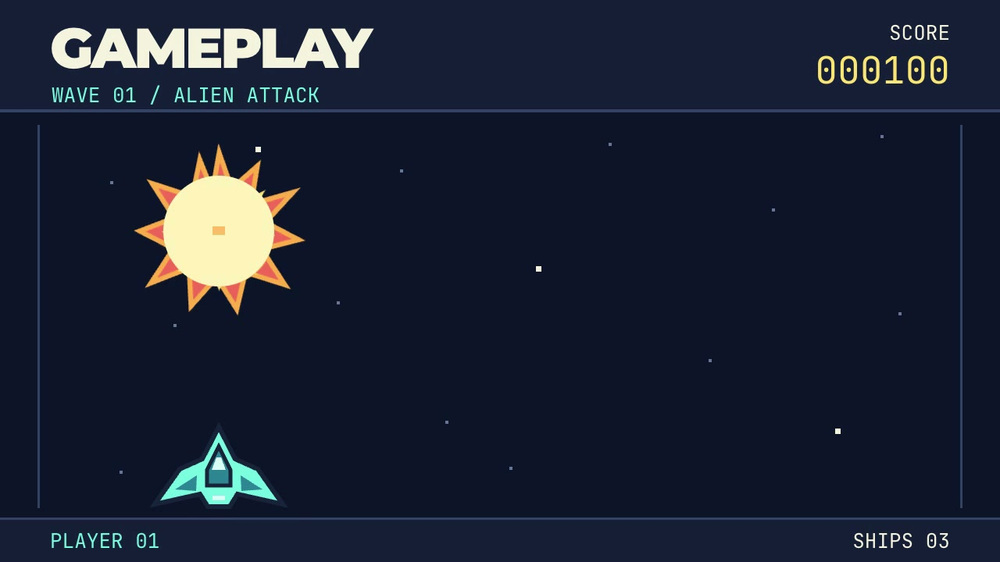

# Mirelo SFX for OpenClaw

Give a silent video sound effects through your existing OpenClaw agent.
This skill calls Mirelo's hosted SFX API, then saves the audio, a video with
sound, and a before/after player. Audio generation happens in the cloud;
setup installs a skill for your current agent and requires no new model or agent.

**Requirements:** Python 3.12+, FFmpeg (including `ffprobe`), a Mirelo API
key with credits, and an existing OpenClaw installation for the agent workflow.
The CLI also works directly. Runtime uses Python's standard library: no pip
packages or virtual environment needed.

## Clone and set up

The repository is currently private; use an account with access when cloning.

```bash
git clone https://github.com/jayrodge/mirelo-sfx-openclaw.git ~/mirelo-sfx-openclaw
cd ~/mirelo-sfx-openclaw
./setup.sh
cp .env.example .env
chmod 600 .env
```

Open `.env` in your editor and set `MIRELO_API_KEY` by hand. Keep keys out of
agent prompts, chat messages, and shell commands/history. Get API access from
[Mirelo Developers](https://mirelo.ai/developers).

```bash
python3 mirelo.py doctor
```

`doctor` checks Python, FFmpeg, credentials and API access without generating
audio. `setup.sh` installs the skill in `~/.openclaw/skills/mirelo-sfx` and points
it at this clone. Keep the clone in place; rerun setup if you move it.

## Try the alien-shooter game clip

The default is eight seconds of original arcade gameplay: a player spaceship
moves and shoots, three enemies explode, and the score climbs. The large hit
flashes and isolated sound bursts make the picture-to-sound connection clear.
See [clip details](examples/README.md).

[](examples/alien-shooter.mp4)

[Watch the example with Mirelo-generated sound](examples/alien-shooter-mirelo.mp4).
This pre-generated sample plays without API access or spending credits.
Check it on your presentation speaker before using it in a crowded room.

Generate one sound design with one command. It uploads the clip, quotes the
cost, checks the 80-credit cap and affordability, then submits one variant:

```bash
python3 mirelo.py generate \
  --video examples/alien-shooter.mp4 \
  --prompt "Three powerful arcade laser-blast explosions synchronized to the three enemy hits at 1.8, 4.0, and 6.2 seconds. Each burst has a crisp electronic zap and crunchy explosive hit with a short decay. Quiet between bursts. No music, speech, ambience or extra shots."
```

Read the cost, status and `out` in the JSON. Open `player.html` from that
folder in a browser. Each completed run contains `silent.mp4`, `sound.wav`,
`with-sound.mp4`, `player.html`, and `job.json`.

Or ask your existing OpenClaw agent:

> Add sound effects to ~/mirelo-sfx-openclaw/examples/alien-shooter.mp4 with this prompt:
> "Three powerful arcade laser-blast explosions synchronized to the three enemy hits at 1.8, 4.0, and 6.2 seconds. Each burst has a crisp electronic zap and crunchy explosive hit with a short decay. Quiet between bursts. No music, speech, ambience or extra shots." Report credits and detected onsets exactly as the JSON prints them.

[Play the arcade game locally](examples/play-game.html): arrow keys move,
Space fires, R restarts and M toggles sound. Each enemy hit plays a burst cut
from this Mirelo result. The game and sound playback work offline and spend
no credits. Download the clone first; GitHub's file view does not run HTML.

For audience participation, play the silent gameplay and let someone describe
the sound style: for example, retro laser, comic-book blast, or futuristic
cannon. Ask the agent for that one sound design, then compare the result.
The bundled sample is one laser-blast design; other styles require their own
explicit generation request.

An explicit generation or refinement request authorizes one paid job within
the 80-credit cap. See the [demo script](docs/demo.md) for the presentation
sequence and fallback. The [Artemis launch sample](examples/artemis-liftoff-mirelo.mp4)
remains available as an alternative.

## Cost, recovery, and credentials

- `preflight` uploads your video to Mirelo and quotes credits; it starts no generation.
- `generate` spends credits after its internal quote, cap and affordability checks.
  The installed agent skill runs it directly for an explicit generation request.
  For cost-only requests, use `preflight` and stop after the quote.
- Each job requests one variant and defaults to an 80-credit cap. Quotes above
  the cap or beyond the account's spend capacity are refused.
- A quote is bound to the saved video and prompt. If you change the sound
  description, run a fresh preflight with the new prompt, then generate.
  Requested refinements use a new folder; the agent never automatically iterates.
- If a submission response is lost, retry the exact same `generate` command.
  The saved request and key recover the original job. Recovery stops after
  24 hours, or if the submission age is unknown; reconcile the original job
  before deciding whether to start another paid generation.
- Polling stops after five minutes. If the result is `poll_timeout`, continue
  with `python3 mirelo.py resume --out <OUT_FROM_JSON>`. Resume never
  resubmits a job. Use a fresh folder for a new generation or refinement.
- Keys are read from `MIRELO_API_KEY`, then `.env` beside `mirelo.py`, then
  `~/.config/mirelo/credentials`. Key files must be private, mode `600`.
  The tool does not print or persist the key in run outputs.
- `.env`, `runs/`, and `outputs/` are Git-ignored. Review generated files before
  sharing: they contain your video, prompt, and job metadata.

## Validation

On October 2, 2026, one direct alien-shooter generation on dspark quoted and
charged 80 credits in 16.27 seconds. The eight-second H.264/AAC result is
bundled unchanged. Measured onsets are `[0.0, 1.86, 4.08, 6.24]`; all three
expected hits at `[1.8, 4.0, 6.2]` passed the ±100 ms signal check. The extra
opening burst and near-full-scale peaks mean this still needs a listening
check on the presentation speaker. Jay accepted the generated video in chat;
crowded-room speaker playback remains unverified. The playable game uses a trimmed first-hit
sample, with a 20 ms fade at the cut's end; it does not generate audio live.
A fresh OpenClaw agent check awaits the separate gateway repair.

One direct CLI generation of the Artemis clip completed
on dspark: 80 credits quoted and charged, 16.40 seconds for the full command,
and an eight-second H.264/AAC result. The generated sample is included above.
This verifies the direct CLI workflow; a fresh OpenClaw agent check awaits
the separate gateway repair. Launch sound alignment needs manual watch/listen
because this clip has no expected-impact sidecar.

The included `examples/silent.mp4` and `silent.json` remain the bouncing-ball sync fixture.
On September 30, 2026, four agent-driven jobs on that ball clip succeeded at 80 credits each
(320 total). Generation turns took about 20–30 seconds. Two outputs passed
the clip's signal-based sync check; two failed. Jay approved run 1 after headphone playback on October 2, 2026.
Validation on the actual event image and presentation setup remains pending,
so these runs do not establish event Demo Ready status. Details and
presentation gates are in the [demo notes](docs/demo.md).

The tests mock Mirelo requests and spend no credits; FFmpeg exercises local
media processing. CI runs them on Python 3.12 and 3.14.

```bash
python3 -m pip install pytest  # test dependency only
python3 -m pytest -q tests
```
