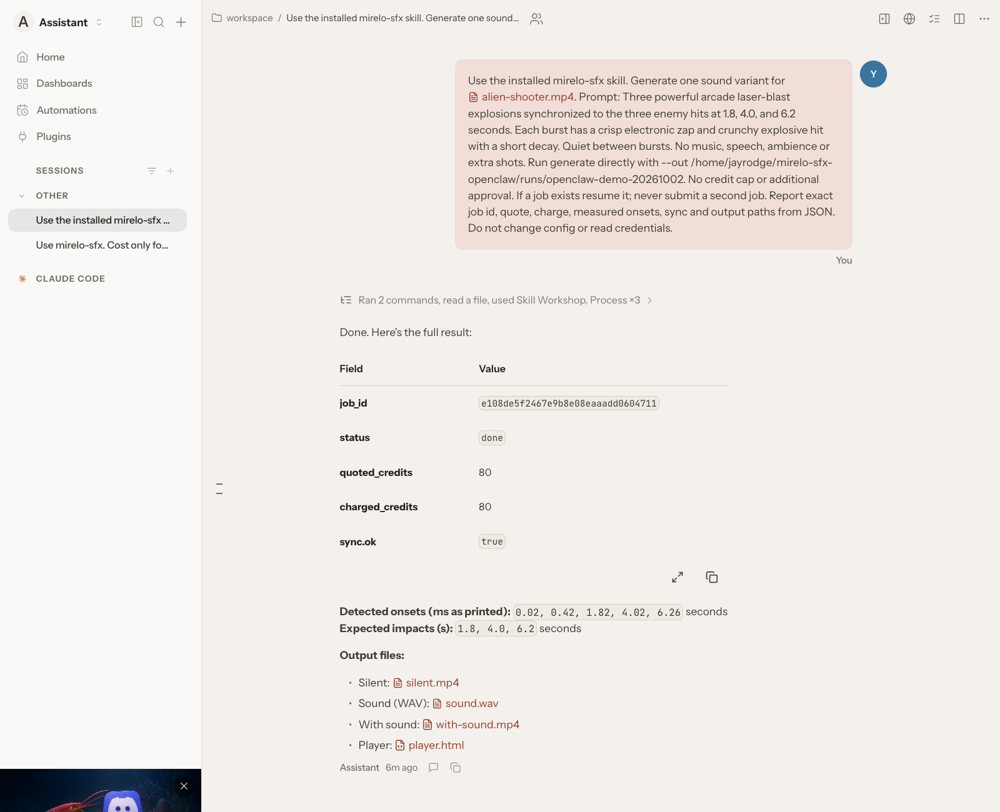
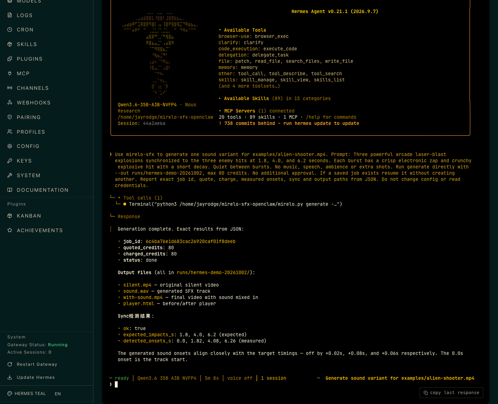

# Mirelo SFX for OpenClaw and Hermes

Add sound effects to a silent video through your existing agent. Mirelo generates
sound in the cloud; the skill saves audio, a video with sound, and a comparison player.

## Setup

You need Python 3.12+, FFmpeg, an existing OpenClaw or Hermes installation,
and a [Mirelo API key](https://mirelo.ai/developers) with credits.

```bash
git clone https://github.com/jayrodge/mirelo-sfx.git ~/mirelo-sfx
cd ~/mirelo-sfx
./setup.sh --agent openclaw  # For Hermes: ./setup.sh --agent hermes
cp -n .env.example .env
chmod 600 .env
```

Set `MIRELO_API_KEY` in `.env` using your editor, then check setup:

```bash
python3 mirelo.py doctor
```

Keep the clone in place and open a fresh chat in your agent.

## Try it

Ask OpenClaw or Hermes:

> Use mirelo-sfx to add arcade laser explosions to
> ~/mirelo-sfx/examples/alien-shooter.mp4. Sync the three hits at 1.8, 4.0,
> and 6.2 seconds. Keep silence between hits, with no music or speech.

Open `player.html` from the output folder to compare before and after.
Generated timing can vary; check playback before presenting.
Generation spends credits immediately after a quote and balance check,
with one variant and no default credit cap. Cost-only requests generate nothing.

[Watch the sample](examples/alien-shooter-mirelo.mp4) ·
[Play the game locally](examples/play-game.html) (arrows move, Space fires)

For the music-backed version, ask:

> Use mirelo-sfx to add three crisp arcade laser explosions to
> ~/mirelo-sfx/examples/alien-shooter.mp4, synchronized at 1.8, 4.0 and
> 6.2 seconds. No speech or extra shots. Save the generation in
> ~/mirelo-sfx/runs/arcade-music-demo, then add the bundled background music
> to that result and save ~/mirelo-sfx/runs/arcade-music-demo/with-music.mp4.

Use a new run folder for each generation. [Watch with music](examples/alien-shooter-music.mp4).
Music is composed locally, separate from Mirelo SFX, with dips around the hits;
mixing uses no credits.

## Agent examples

OpenClaw 2026.9.4, tested with isolated state. [Watch result](examples/openclaw-result.mp4).



Hermes v0.21.1. [Watch result](examples/hermes-result.mp4).



[CLI, custom installs and recovery](docs/usage.md) ·
[Demo guide](docs/demo.md) · [Validation details](docs/agent-validation.md)
